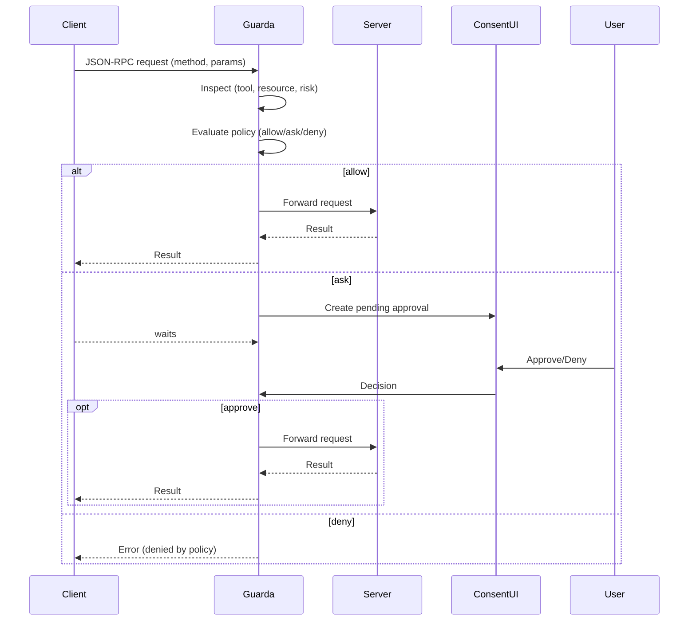

# Architecture (PoC)

## Components
- **Guard Core**: JSON-RPC NDJSON proxy; policy engine; consent API.
- **Consent UI**: simple localhost web (served by guard-core).
- **Policy Bundles**: YAML with allow/ask/deny rules and matchers.
- **Examples**: echo servers that mimic tools (`files.read`, `files.write`, `net.fetch`, `shell.exec`).

## Sequence (Mermaid)

## Data
- **AuditEvent**: `{ts, method, resource, decision, reason, server, user}` (JSONL).
- **Approval**: in-memory, TTL.
- **Policy**: YAML parsed to rules; hot-reload planned.

## Roadmap to production
- Implement MCP stdio framing (Content-Length), WS transport.
- WebAuthn approvals; diff viewer for writes; container sandbox runner.
- Central policy sync; SSO; OPA/Cerbos adapter.
