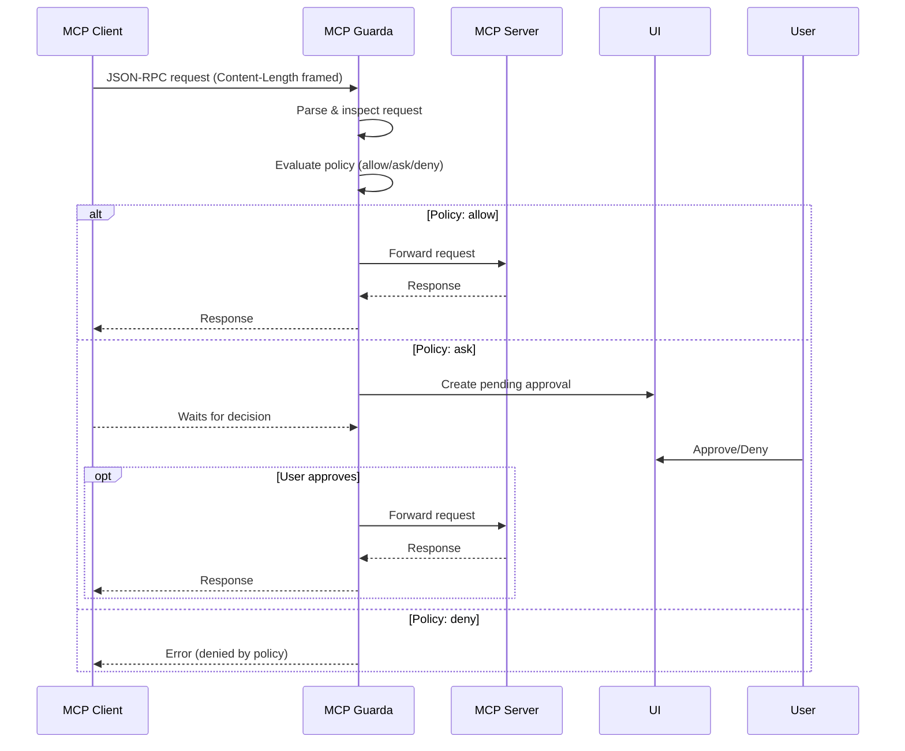

# MCP Guarda

**MCP Guarda** is a local **policy proxy + consent gateway** for MCP (Model Context Protocol) toolchains. It sits between MCP clients and servers, enforcing **deny-by-default** policies, intent-bound approvals, sandboxing for writes, and full audit logs.

> 🔒 **Security-first approach**: Every operation requires explicit policy approval or user consent before execution.

## Repository Structure

### 📁 Current Working Implementation
- **[MCP_Guarda_starter/](./MCP_Guarda_starter/)** - Working PoC with NDJSON proxy, web UI, policies, and demo
- **[MCP_Guarda_starter/TASKS.md](./MCP_Guarda_starter/TASKS.md)** - Legacy task tracking (see INTEGRATED_TASKS.md)

### 📁 Latest Modular Components  
- **[packages/guard-core/](./packages/guard-core/)** - New modular components:
  - `src/adapters/content_length_adapter.js` - Real MCP Content-Length framing support
  - `src/approval_cache.js` - Enhanced 10-minute TTL approval caching

### 📋 Comprehensive Planning
- **[INTEGRATED_TASKS.md](./INTEGRATED_TASKS.md)** - **Main task list** integrating latest work with roadmap
- **[INTEGRATION_GUIDE.md](./INTEGRATION_GUIDE.md)** - Step-by-step guide to merge components
- **[docs/IMPLEMENTATION_CHECKLIST.md](./docs/IMPLEMENTATION_CHECKLIST.md)** - Original comprehensive roadmap

## Quick Start

### Current Demo (NDJSON-based)
```bash
cd MCP_Guarda_starter/packages/guard-core
npm install
node index.js --policy ../policy-bundles/default.yaml --port 8787 -- node ../examples/echo-mcp-server.js

# In another terminal
cd MCP_Guarda_starter/packages/examples  
node echo-mcp-client.js
```
Open http://localhost:8787 to approve/deny requests.

### Next: Real MCP Integration
The latest `packages/guard-core/` components enable real MCP Content-Length framing. See [INTEGRATION_GUIDE.md](./INTEGRATION_GUIDE.md) for merging these with the working starter.

## Current Status

### ✅ Working Features
- **Policy Engine**: allow/ask/deny rules with path/host matchers
- **Consent Web UI**: Browser-based approval interface  
- **Audit Logging**: Complete JSONL audit trail
- **Demo System**: NDJSON-based client/server examples
- **Approval Caching**: 10-minute "remember" functionality
- **Content-Length Framing**: Real MCP protocol support (in packages/)

### 🔄 Integration Phase
**Current Priority**: Merge latest modular components with proven MCP_Guarda_starter foundation.

**See**: [INTEGRATED_TASKS.md](./INTEGRATED_TASKS.md) Phase 1.1 - Integration of latest guard-core components.

## Key Features

### 🛡️ Security Controls
- **Deny-by-default policies** - Nothing runs without explicit permission
- **Intent-bound approvals** - Users see exactly what will happen
- **Write quarantine** - File changes can be inspected and reverted
- **Network allowlists** - Control which hosts can be accessed
- **Execution gates** - Commands require approval or allowlisting

### 📊 Audit & Compliance  
- **Complete audit logs** - Every decision tracked with context
- **Encrypted storage** - Approvals and logs secured at rest
- **Export capabilities** - CSV/JSON export for compliance reporting
- **Session tracking** - Link approvals to specific processes/users

### 🎯 User Experience
- **Minimal approval fatigue** - Smart caching and reasonable defaults
- **Clear intent display** - Users understand what they're approving
- **Multiple interfaces** - Web UI, CLI, TUI for different environments
- **Easy installation** - npx, brew, and installer packages planned

## Architecture



## Development Roadmap

### Phase 1: Integration (Week 0-1) 🔄 **CURRENT**
- [x] Content-Length framing adapter
- [x] Enhanced approval cache
- [ ] Component integration
- [ ] Write quarantine system

### Phase 2: Production (Week 1-3)
- [ ] Encrypted local storage  
- [ ] Network & execution controls
- [ ] Policy pack system
- [ ] CLI/TUI interfaces

### Phase 3: Distribution (Week 3-4)
- [ ] Packaging & installers
- [ ] Documentation polish
- [ ] Demo videos & guides

### Phase 4: Advanced Features (Week 4+)
- [ ] WebAuthn integration
- [ ] Team collaboration features
- [ ] Telemetry & health monitoring

See [INTEGRATED_TASKS.md](./INTEGRATED_TASKS.md) for detailed task breakdown.

## Development with Warp

For comprehensive development guidelines when using the Warp terminal, see **[WARP.md](./WARP.md)**. This file includes:
- Essential commands for building, testing, and running the project
- Architecture overview and key code patterns
- Troubleshooting guides and debugging commands
- Current development phase and priorities

## Contributing

1. **Current Priority**: Help with integration in [INTEGRATION_GUIDE.md](./INTEGRATION_GUIDE.md)
2. **Task Selection**: Pick items from [INTEGRATED_TASKS.md](./INTEGRATED_TASKS.md)  
3. **Architecture**: Follow patterns in `packages/guard-core/src/`
4. **Testing**: Ensure both NDJSON demo and Content-Length production paths work

## License

Apache 2.0 - See LICENSE file

---

**Maintainer**: @GSCrawley  
**Status**: Integration phase - combining latest guard-core work with proven foundation  
**Next**: [Phase 1.1 Integration](./INTEGRATED_TASKS.md#11-integrate-latest-guard-core-components-2d) of guard-core components